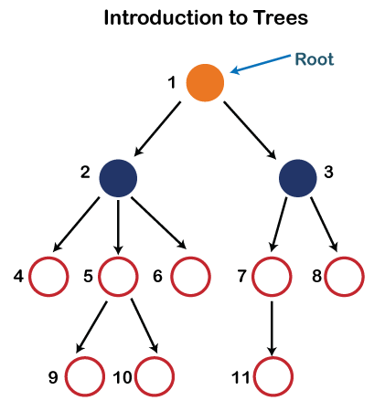

# What is an Algorithm?

An Algorithm is a set of well defined instructions to solve a particular problem

## Characteristics of an Algorithm

- Well defined inputs and outputs
- Each step should be clear and unambiguous
- Language independent

## Why Algorithms?

- As a developer, you're going to come across problems that you need to solve
- Learning algorithms translates to learning different techniques to efficiently solve those problems
- One problem can be solved in many ways using different algorithms
- Every algorithm comes with its own tradeoffs when it comes to performance

## Algorithm analysis

- We evaluate the performance of an algorithm in terms of its input size
  - Time complexity: Amount of time taken by an algorithm to run, as a function of input size
  - Space complexity: Amount of memory taken by an algorithm to run, as a function of input size
- By evaluating against the input size, the analysis is not only machine independent but the comparison is also more appropriate
- There is no one solution that works every single time. It is always good to know multiple ways to solve the problem and use the best solution, given your constraints
- If your app needs to be very quick and has plenty of memory to work with, you don't have to worry about space complexity
- If you have very little memory to work with, you should pick a solution that is relatively slower but needs less space

## How to represent complexity?

Asymptomatic notations: Mathematical tools to represent time and space complexity

- Big-O Notation (O-notation): Worst case complexity
- Omega Notation (Ω-notation): Best case complexity
- Theta Notation (Θ-notation): Average case complexity

## Big-O Notation

- The worst case complexity of an algorithm is represented using the Big-O notation
- Big-O notation describes the complexity of an algorithm using algebraic terms
- It has two important characteristics:
  - It is expressed in terms of the input
  - It focuses on the bigger picture without getting caught up in the minute details

### Big-O Time complexity:

```js
    function summation(n){
        let sum = 0; // will be executed once
        for(let i=1; i<=n; i++>){
            sum+=i; // will be executed 4 times
        }
        return sum; // will be executed once
    }
```

- So the time complexity of the above code is **n+2**. It is expressed in terms of the input
- We can say time complexity of the above code is **n**, if we focus on the bigger picture without getting caught up in the minute details. Because, if n is 1000, 2 is insignificant in front of that
- O(n) is a linear time complexity.

```js
function summation(n) {
  return (n * (n + 1)) / 2;
}
```

- The time complexity of the above code is **1**.
- O(1) is a Constant time complexity.

```js
for (i = 1; i <= n; i++) {
  for (j = 1; j <= i; j++) {
    // some code
  }
}
```

- The time complexity of the above code is **n<sup>2</sup>**
- O(n<sup>2</sup>) is a Quadratic time complexity
- If there are 3 loops, then the time complexity is **n<sup>3</sup>**
- O(n<sup>3</sup>) is a Cubic time complexity.
- If input size reduces by half on every iteration, then the time complexity is **logn**
- O(logn) is a logarithmic time complexity.

### Big-O Space complexity:

- We can find Space complexity in the following three types:
  - O(1): Constant space complexity
  - O(n): Linear space complexity
  - O(logn): Logarithmic space complexity.


- Multiple algorithms exist for the same problem and there is no one right solution. Different algorithms work well under different constraints.
- The same algorithm with the same programming language can be implemented in different ways
- When writing programs at work, don't lose sight of the big picture. Rather than writing clever code, write code that is simple to read and maintain.

## Objects and Arrays Big-O:

### Objects:

- An object is a collection of key value pairs
- Insert: O(1)
- Remove: O(1)
- Access: O(1)
- Search: O(n)
- Object.keys: O(n)
- Object.values: O(n)
- Object.entries: O(n)

### Arrays:

- An array is an ordered collection of values
- Insert / remove at end: O(1)
- Insert / remove at beginning: O(n)
- Access: O(1)
- Search: O(n)
- push / pop: O(1)
- shift / unshift / concat / slice / splice: O(n)
- forEach / map / filter / reduce: O(n)

# Recursion

- Recursion is a programming technique where a function calls itself repeatedly until it reaches a base case that stops
- It is a great technique to simplify your solution
- Every recursive solution needs to have a base case: a condition to terminate the recursion
- Recursion might simplify solving a problem, but it does not always translate to a faster solution. A recursive solution may be far worse compared to an iterative solution.

# Math Algorithms:

## Fibonacci Series:

- A series of numbers in which each number ( Fibonacci number ) is the sum of the two preceding numbers. The simplest is the series 1, 1, 2, 3, 5, 8, etc.
- Big-O --> O(n)

## Factorial:

- The Factorial of a whole number 'n' is defined as the product of that number with every whole number less than or equal to 'n' till 1. For example, the factorial of 4 is 4 × 3 × 2 × 1, which is equal to 24. It is represented using the symbol '!' So, 24 is the value of 4!.
- Big-O --> O(n)

## Is Power of Two:

- Check whether the given number is a power of two or not
- Big-O --> O(logn) [worst case], O(1) [Best case]

## Is Prime:

- Check whether the given number is a prime number or not
- Big-O --> O(n) [worst case], O(sqrt(n)) [Best case]

# Recursion:

## Fibonacci Series:

- Big-O --> O(2^n)

## Factorial:

- Big-O --> O(n)

# Search Algorithms:

## Binary Search:

- A binary search is a search algorithm that finds the position of a target value in a sorted array. It's also known as half-interval search, logarithmic search, or binary chop
- Big-O --> O(logn)

## Recursive Binary Search:

- Big-O --> O(logn)

## Linear Search:

- A linear search, also known as a sequential search, is a simple method for finding an element in a list by checking each element one by one until a match is found
- Big-O --> O(n)

# Sorting Algorithms:

## Bubble Sort:

- Bubble sort is a sorting algorithm that arranges a set of elements in order by comparing adjacent elements and swapping them if they are out of order. The algorithm repeats this process until the entire set is sorted.
- Big-O --> O(n^2)

## Insertion Sort:

- Insertion sort is a sorting algorithm that builds a sorted array by moving each item into its correct position in a sorted sub-list. It's one of the simplest and most commonly used sorting algorithms.
- Big-O --> O(n^2)

## Merge Sort:

- Merge sort is a sorting algorithm that's based on the divide-and-conquer strategy. Merge sort breaks a list into smaller sublists until each sublist has only one item, and then merges the sublists in a sorted order. Merge sort is considered one of the most efficient sorting algorithms.
- Big-O --> O(nlogn)

## Quick Sort:

- Quick sort is a sorting algorithm that uses a divide-and-conquer strategy to sort an array by breaking it down into smaller arrays. It works by:
  - Selecting a pivot: Choosing a value in the array to be the pivot element
  - Sorting by value: Ordering the remaining values in the array so that those smaller than the pivot are on the left and those larger are on the right
  - Swapping the pivot: Swapping the pivot element with the first element of the larger values
  - Repeating: Recursively applying these steps to the sub-arrays on either side of the pivot
  - Continuing: Repeating the process until the sub-arrays are too small to sort
- Big-O --> O(n^2) [worst case], O(nlogn)[Avg. case]

# Miscellaneous:

## Cartesian Product:

- In mathematics, specifically set theory, the Cartesian product of two sets A and B, denoted A × B, is the set of all ordered pairs where a is in A and b is in B. In terms of set-builder notation, that is A table can be created by taking the Cartesian product of a set of rows and a set of columns.
- Big-O --> O(mn)

## Climbing Staircase:

- The climbing staircase algorithm is a problem that involves finding the number of ways to climb a staircase by taking one or two steps at a time. The algorithm is based on a technique called "state decomposition", which breaks the problem down into smaller, more manageable parts.
- Big-O --> O(n)

## Tower of Hanoi:

- The Tower of Hanoi algorithm is a recursive algorithm that solves the Tower of Hanoi puzzle by breaking it down into smaller problems. The algorithm uses the following rules to move a stack of disks between three rods:
  - Only one disk can be moved at a time
  - No disk can be placed on top of a smaller disk
- The algorithm's steps are:
  - Choose two rods as the source and destination, and a third as the auxiliary peg
  - Move the top n-1 disks from the source peg to the auxiliary peg
  - Move the nth disk from the source peg to the destination peg
  - Move the remaining n-1 disks from the auxiliary peg to the destination peg
- The minimum number of moves required to solve the puzzle is 2^n - 1, where n is the number of disks.
- Big-O --> O(2^n)

# Algorithm design techniques

- **Brute force:** Simple and exhaustive technique that evaluates every possible outcome to find the best solution. Ex: Linear search
- **Greedy:** Choose the best option at the current time, without any consideration for the future. Ex: Dijkstra's algorithm, Prim's algorithm and Kruskal's algorithm
- **Divide and Conquer:** Divide the problem into smaller sub-problems. Each sub-problem is then solved and the partial solutions are recombined to determine the overall solution. Ex: Binary Search, Quick Sort, Merge Sort and Tower of Hanoi
- **Dynamic Programming:** Divide the problem into smaller sub-problems. Break it down into smaller but overlapping sub problems. Store the result and reuse it for the same sub-problems. This is called memoization and is a optimization technique that improves the time complexity of your algorithm. Ex: Fibonacci numbers and Climbing staircase
- **Backtracking:** Generate all possible solutions. Check if the solution satisfies all the given constrains and only then you proceed with generating subsequent solutions. If the constraints are not satisfied, backtrack and go on a different path to find the solution. Ex: N-Queens problem

# Data Structures

- A data structure is a way to store and organize data so that it can be used efficiently
- A data structure is a collection of data values, the relationships among them, and the functions or operations that can be applied to that data
- Why learn data structures?
  - Almost every application we build involves data that is modelled in a certain way
  - To efficiently manage that data, you need data structures
  - The difference between a function taking a few milliseconds vs a few seconds or even minutes comes down to the selection of the right data structure
  - Data structures help you solve problems in a more efficient way, both in terms of time and memory
    - DOM: Tree Data Structure
    - Browser back and forward: Stack Data Structure
    - OS job scheduling: Queue Data Structure
  - Built in Data Structures:
    - Arrays
    - Objects
    - Sets
    - Maps
  - Custom Data Structures:
    - Stacks
    - Queues
    - Circular queues
    - Linked lists
    - Hash tables
    - Trees
    - Graphs

## Array DS:

- An array is a data structure that can hold a collection of values
- Arrays can contain a mix of different data types. You can store strings, booleans, numbers or even objects all in the same array
- Arrays are resizable. You don't have to declare the size of an array before creating it
- JS arrays are zero-indexed and the insertion order is maintained
- Arrays are iterables. They can be used with a for of loop

## Object DS:

- An object is an unordered collection of key-value pairs. The key must either be a string or symbol data type where as the value can be of any data type
- To retrieve a value, you can use the corresponding key. This can be achieved using the dot notation or bracket notation
- An object is not an iterable.

## Sets DS:

- A set is a data structure that can hold a collection of values. The values however must be unique
- Set can contain a mix of different data types. You can store strings, booleans, numbers or even objects all in the same set
- Sets are dynamically sized. You don't have to declare the size of a set before creating it
- Sets do not maintain an insertion order
- Sets are iterable.

### Set vs Array:

- Arrays can contain duplicate values whereas Sets cannot
- Insertion order is maintained in arrays but it is not the case with sets
- Searching and deleting an element in the set is faster compared to arrays

## Map DS:

- A map is an unordered collection of key-value pairs. Both keys and values can be of any data type
- To retrieve a value, you can use the corresponding key
- Maps are iterable

### Map vs Object:

- Objects are unordered whereas maps are ordered
- Keys in objects can only be string or symbol type whereas in maps, they can be of any type
- An object has a prototype and may contain a few default keys which may collide with your own keys if you're not careful. A map on the other hand does not contain any keys by default
- Objects are not iterable whereas maps are iterable
- The number of items in an object must be determined manually where as it is readily available with the size property in a map
- Apart from storing data, you can attach functionality to an object whereas maps are restricted to just storing data

## Stack DS:

- The stack data structure is a sequential collection of elements that follows the principle of Last In First Out (LIFO)
- The last element inserted into the stack is first element to be removed
- Stack is an abstract data type. It is defined by its behavior rather than being a mathematical model
- The stack data structure supports two main operations
  - Push, which adds an element to the collection
  - Pop, which removes the most recently added element from the collection
- Stack use cases:
  - Browser history tracking
  - Undo operation when typing
  - Expression conversions
  - Call stack in Javascript runtime

## Queue DS:

- The queue data structure is a sequential collection of elements that follows the principle of First In First Out (FIFO)
- The first element inserted into the queue is first element to be removed
- Queue is an abstract data type. It is defined by its behavior rather than being a mathematical model
- The queue data structure supports two main operations:
  - Enqueue: Which adds an element to the rear/tail of the collection
  - Dequeue: Which removes an element from the front/head of the collection
- Queue use cases:
  - Printers
  - CPU task scheduling
  - Callback queue in Javascript runtime

## Circular Queue DS:

- The size of the queue is fixed and a single block of memory is used as if the first element is connected to the last element
- Also referred as circular buffer or ring buffer and follows FIFO principle
- A circular queue will reuse the empty block created during the dequeue operation
- When working with queues of fixed maximum size, a circular queue is a great implementation choice
- The circular queue data structure supports two main operations:
  - Enqueue: Which adds an element to the rear/tail of the collection
  - Dequeue: Which removes an element from the front/head of the collection
- Circular Queue use cases:
  - Clock
  - Streaming data
  - Traffic lights

## Linked List DS:

- A linked list is a linear data structure that includes a series of connected nodes
- Each node consists of a data value and a pointer that points to the next node
- The list elements can be easily inserted or removed without reallocation or reorganization of the entire structure
- Random access of elements is not feasible and accessing an element has linear time complexity
- The linked list data structure supports three main operations:
  - Insertion: To add an element at the beginning, end or at a given index in the list
  - Deletion: To remove an element given its index or value
  - Search: To find an element given its value
- Linked List use cases:
  - All applications of both stacks and queues are applications of linked lists
  - Image viewer

## Hash Table / Hash Map:

- It is a data structure that is used to store key-value pairs
- Given a key, you can associate a value with that key for very fast lookup
- JavaScript's Object is a special implementation of the hash table data structure. However, Object class adds its own keys. Keys that you input may conflict and overwrite the inherited default properties
- Maps which were introduced in ES6 allow you to store key-value pairs
- Writing your own hash table implementation is a very popular JS interview question
- We store the key value pairs in a fix sized array
- Arrays have a numeric index
- How do we go from using a string as an index to number as an index?
  - A hashing function accepts the string key, converts it into a hash code using a defined logic and then maps it into a numeric index that is within the bounds of the array
  - Using the index, store the value
  - The same hashing function is reused to retrieve the value given a key:
    - Set to store a key-value pair
    - Get to retrieve a value given its key
    - Remove to delete a key value pair
- Hash table use cases:
  - Hash tables are typically implemented where constant time lookup and insertion are required
  - Database indexing
  - Caches

## Tree:

- A tree is a hierarchial data structure that consists of nodes connected by edges
- A tree is a non-linear data structure, compared to arrays, linked lists, stacks, and queues which are linear data structures
- In linear data structures, the time required to search is proportional to the size of the data set
- Trees however, owing to the non-linear nature allow quicker and easier access to the data
- A tree will not contain any loops or cycles.
- Tree use cases:

  - File system for directory structure
  - A family tree
  - An organization tree
  - DOM
  - Chat bots
  - Abstract syntax tree

### Tree Terminology:



- **Root:** The root node is the topmost node in the tree hierarchy. In other words, the root node is the one that doesn't have any parent. In the above structure, node numbered 1 is the root node of the tree. If a node is directly linked to some other node, it would be called a parent-child relationship.
- **Child node:** If the node is a descendant of any node, then the node is known as a child node.
- **Parent:** If the node contains any sub-node, then that node is said to be the parent of that sub-node.
- **Sibling:** The nodes that have the same parent are known as siblings.
- **Leaf Node:** The node of the tree, which doesn't have any child node, is called a leaf node. A leaf node is the bottom-most node of the tree. There can be any number of leaf nodes present in a general tree. Leaf nodes can also be called external nodes.Internal nodes: A node has at least one child node known as an internal
- **Ancestor node:** An ancestor of a node is any predecessor node on a path from the root to that node. The root node doesn't have any ancestors. In the tree shown in the above image, nodes 1, 2, and 5 are the ancestors of node 10.
- **Descendant:** The immediate successor of the given node is known as a descendant of a node. In the above figure, 10 is the descendant of node 5.
- **Number of edges:** If there are n nodes, then there would n-1 edges. Each arrow in the structure represents the link or path. Each node, except the root node, will have at least one incoming link known as an edge. There would be one link for the parent-child relationship.
- **Depth of node x:** The depth of node x can be defined as the length of the path from the root to the node x. One edge contributes one-unit length in the path. So, the depth of node x can also be defined as the number of edges between the root node and the node x. The root node has 0 depth.
- **Height of node x:** The height of node x can be defined as the longest path from the node x to the leaf node.

### Applications of trees:

- **Storing naturally hierarchical data:** Trees are used to store the data in the hierarchical structure. For example, the file system. The file system stored on the disc drive, the file and folder are in the form of the naturally hierarchical data and stored in the form of trees.
- **Organize data:** It is used to organize data for efficient insertion, deletion and searching. For example, a binary tree has a logN time for searching an element.
- **Trie:** It is a special kind of tree that is used to store the dictionary. It is a fast and efficient way for dynamic spell checking.
- **Heap:** It is also a tree data structure implemented using arrays. It is used to implement priority queues.
- **B-Tree and B+Tree:** B-Tree and B+Tree are the tree data structures used to implement indexing in databases.
- **Routing table:** The tree data structure is also used to store the data in routing tables in the routers.

### Types of Tree data structure:

- **General Tree:** The general tree is one of the types of tree data structure. In the general tree, a node can have either 0 or maximum n number of nodes. There is no restriction imposed on the degree of the node (the number of nodes that a node can contain). The topmost node in a general tree is known as a root node. The children of the parent node are known as subtrees. There can be n number of subtrees in a general tree. In the general tree, the subtrees are unordered as the nodes in the subtree cannot be ordered. Every non-empty tree has a downward edge, and these edges are connected to the nodes known as child nodes. The root node is labeled with level 0. The nodes that have the same parent are known as siblings.
- **Binary Tree:** Here, binary name itself suggests two numbers, i.e., 0 and 1. In a binary tree, each node in a tree can have utmost two child nodes. Here, utmost means whether the node has 0 nodes, 1 node or 2 nodes.
- **Binary Search Tree:** Binary search tree is a non-linear data structure in which one node is connected to n number of nodes. It is a node-based data structure. A node can be represented in a binary search tree with three fields, i.e., data part, left-child, and right-child. A node can be connected to the utmost two child nodes in a binary search tree, so the node contains two pointers (left child and right child pointer). Every node in the left subtree must contain a value less than the value of the root node, and the value of each node in the right subtree must be bigger than the value of the root node.
- **AVL Tree:** It is one of the types of the binary tree, or we can say that it is a variant of the binary search tree. AVL tree satisfies the property of the binary tree as well as of the binary search tree. It is a self-balancing binary search tree that was invented by Adelson Velsky Lindas. Here, self-balancing means that balancing the heights of left subtree and right subtree. This balancing is measured in terms of the balancing factor. We can consider a tree as an AVL tree if the tree obeys the binary search tree as well as a balancing factor. The balancing factor can be defined as the difference between the height of the left subtree and the height of the right subtree. The balancing factor's value must be either 0, -1, or 1; therefore, each node in the AVL tree should have the value of the balancing factor either as 0, -1, or 1.
- **Red-Black Tree:** The red-Black tree is the binary search tree. The prerequisite of the Red-Black tree is that we should know about the binary search tree. In a binary search tree, the value of the left-subtree should be less than the value of that node, and the value of the right-subtree should be greater than the value of that node. As we know that the time complexity of binary search in the average case is log2n, the best case is O(1), and the worst case is O(n). When any operation is performed on the tree, we want our tree to be balanced so that all the operations like searching, insertion, deletion, etc., take less time, and all these operations will have the time complexity of log2n. The red-black tree is a self-balancing binary search tree. AVL tree is also a height balancing binary search tree then why do we require a Red-Black tree. In the AVL tree, we do not know how many rotations would be required to balance the tree, but in the Red-black tree, a maximum of 2 rotations are required to balance the tree. It contains one extra bit that represents either the red or black color of a node to ensure the balancing of the tree.
- **Splay Tree:** The splay tree data structure is also binary search tree in which recently accessed element is placed at the root position of tree by performing some rotation operations. Here, splaying means the recently accessed node. It is a self-balancing binary search tree having no explicit balance condition like AVL tree. It might be a possibility that height of the splay tree is not balanced, i.e., height of both left and right subtrees may differ, but the operations in splay tree takes order of logN time where n is the number of nodes. Splay tree is a balanced tree but it cannot be considered as a height balanced tree because after each operation, rotation is performed which leads to a balanced tree.
- **Treap:** Treap data structure came from the Tree and Heap data structure. So, it comprises the properties of both Tree and Heap data structures. In Binary search tree, each node on the left subtree must be equal or less than the value of the root node and each node on the right subtree must be equal or greater than the value of the root node. In heap data structure, both right and left subtrees contain larger keys than the root; therefore, we can say that the root node contains the lowest value. In treap data structure, each node has both key and priority where key is derived from the Binary search tree and priority is derived from the heap data structure. The Treap data structure follows two properties which are given below:
  - Right child of a node>=current node and left child of a node <=current node (binary tree)
  - Children of any subtree must be greater than the node (heap)
- **B-Tree:** B-tree is a balanced m-way tree where m defines the order of the tree. Till now, we read that the node contains only one key but b-tree can have more than one key, and more than 2 children. It always maintains the sorted data. In binary tree, it is possible that leaf nodes can be at different levels, but in b-tree, all the leaf nodes must be at the same level. If order is m then node has the following properties:
  - Each node in a b-tree can have maximum m children
  - For minimum children, a leaf node has 0 children, root node has minimum 2 children and internal node has minimum ceiling of m/2 children. For example, the value of m is 5 which means that a node can have 5 children and internal nodes can contain maximum 3 children.
  - Each node has maximum (m-1) keys.
- The root node must contain minimum 1 key and all other nodes must contain at least ceiling of m/2 minus 1 keys.

## Graph:

- A graph is a non-linear data structure that consists of a finite number of nodes or vertices connected by edges.
- Trees are a specific type of graph data structure
- Types of graphs:
  - Directed:
    - A graph in which the edges have a direction
    - Edges are usually represented by arrows pointing in the direction the graph can be traversed
  - Undirected:
    - A graph in which the edges are bidirectional
    - The graph can be traversed in either direction
    - The absence of an arrow tells us that the graph is undirected
- Graph usages:
  - Google Maps
  - Social media sites
- Graph Representation:
  - Adjacency matrix:
    - An adjacency matrix is a 2D array of size V x V, where, V is the number of vertices in the graph
    - Each row and column represent a vertex
    - If the value of any element say, matrix[i][j] is 1, it represents that there is an edge connecting vertex i and vertex j
  - Adjacency list:
    - Vertices are stored in a map like data structure, and every vertex stores a list of its adjacent vertices
    - It is more efficient than the adjacency matrix when the graph is sparse
  - Adjacency matrix vs Adjacency list:
    - With an adjacency list, we only need to store the values for the edges that exist.
    - With an adjacency matrix, you store values irrespective of whether an edge exists or not.
    - Storage wise, an adjacency list is way more efficient
    - With an adjacency list, inserting and finding adjacent nodes is constant time complexity whereas with adjacency matrix, it is linear time complexity
    - An adjacency list allows you to store additional values with an edge such as weight of the edge. With adjacency matrix, such information would have to be stored externally

# Further learning:

- Priority Queue
- Circular Linked Lists
- AVL Trees, Red Black Trees and Tries
- Directed Acyclic Graphs
- Prim's, Kruskal's and Floyd's algorithms
- Solve problems that utilize these data structures
