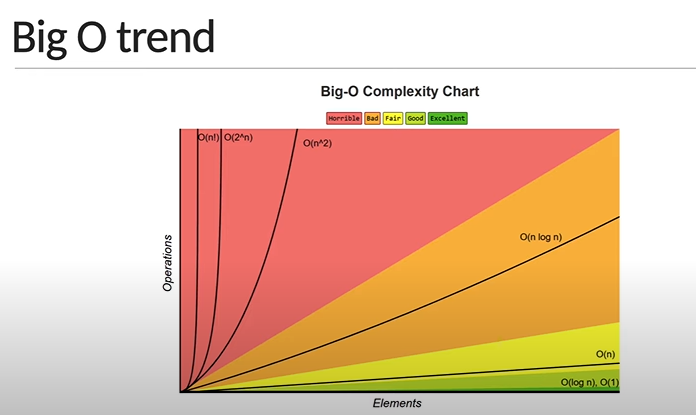

# What is an Algorithm?

An Algorithm is a set of well defined instructions to solve a particular problem

## Characteristics of an Algorithm

- Well defined inputs and outputs
- Each step should be clear and unambiguous
- Language independent

## Why Algorithms?

- As a developer, you're going to come across problems that you need to solve
- Learning algorithms translates to learning different techniques to efficiently solve those problems
- One problem can be solved in many ways using different algorithms
- Every algorithm comes with its own tradeoffs when it comes to performance

## Algorithm analysis

- We evaluate the performance of an algorithm in terms of its input size
  - Time complexity: Amount of time taken by an algorithm to run, as a function of input size
  - Space complexity: Amount of memory taken by an algorithm to run, as a function of input size
- By evaluating against the input size, the analysis is not only machine independent but the comparison is also more appropriate
- There is no one solution that works every single time. It is always good to know multiple ways to solve the problem and use the best solution, given your constraints
- If your app needs to be very quick and has plenty of memory to work with, you don't have to worry about space complexity
- If you have very little memory to work with, you should pick a solution that is relatively slower but needs less space

## How to represent complexity?

Asymptomatic notations: Mathematical tools to represent time and space complexity

- Big-O Notation (O-notation): Worst case complexity
- Omega Notation (Ω-notation): Best case complexity
- Theta Notation (Θ-notation): Average case complexity

## Big-O Notation

- The worst case complexity of an algorithm is represented using the Big-O notation
- Big-O notation describes the complexity of an algorithm using algebraic terms
- It has two important characteristics:
  - It is expressed in terms of the input
  - It focuses on the bigger picture without getting caught up in the minute details

### Big-O Time complexity:

```js
    function summation(n){
        let sum = 0; // will be executed once
        for(let i=1; i<=n; i++>){
            sum+=i; // will be executed 4 times
        }
        return sum; // will be executed once
    }
```

- So the time complexity of the above code is **n+2**. It is expressed in terms of the input
- We can say time complexity of the above code is **n**, if we focus on the bigger picture without getting caught up in the minute details. Because, if n is 1000, 2 is insignificant in front of that
- O(n) is a linear time complexity.

```js
function summation(n) {
  return (n * (n + 1)) / 2;
}
```

- The time complexity of the above code is **1**.
- O(1) is a Constant time complexity.

```js
for (i = 1; i <= n; i++) {
  for (j = 1; j <= i; j++) {
    // some code
  }
}
```

- The time complexity of the above code is **n<sup>2</sup>**
- O(n<sup>2</sup>) is a Quadratic time complexity
- If there are 3 loops, then the time complexity is **n<sup>3</sup>**
- O(n<sup>3</sup>) is a Cubic time complexity.
- If input size reduces by half on every iteration, then the time complexity is **logn**
- O(logn) is a logarithmic time complexity.

### Big-O Space complexity:

- We can find Space complexity in the following three types:
  - O(1): Constant space complexity
  - O(n): Linear space complexity
  - O(logn): Logarithmic space complexity.



- Multiple algorithms exist for the same problem and there is no one right solution. Different algorithms work well under different constraints.
- The same algorithm with the same programming language can be implemented in different ways
- When writing programs at work, don't lose sight of the big picture. Rather than writing clever code, write code that is simple to read and maintain.

## Objects and Arrays Big-O:

### Objects:

- An object is a collection of key value pairs
- Insert: O(1)
- Remove: O(1)
- Access: O(1)
- Search: O(n)
- Object.keys: O(n)
- Object.values: O(n)
- Object.entries: O(n)

### Arrays:

- An array is an ordered collection of values
- Insert / remove at end: O(1)
- Insert / remove at beginning: O(n)
- Access: O(1)
- Search: O(n)
- push / pop: O(1)
- shift / unshift / concat / slice / splice: O(n)
- forEach / map / filter / reduce: O(n)

# Recursion

- Recursion is a programming technique where a function calls itself repeatedly until it reaches a base case that stops
- It is a great technique to simplify your solution
- Every recursive solution needs to have a base case: a condition to terminate the recursion
- Recursion might simplify solving a problem, but it does not always translate to a faster solution. A recursive solution may be far worse compared to an iterative solution.

# Math Algorithms:

## Fibonacci Series:

- A series of numbers in which each number ( Fibonacci number ) is the sum of the two preceding numbers. The simplest is the series 1, 1, 2, 3, 5, 8, etc.
- Big-O --> O(n)

## Factorial:

- The Factorial of a whole number 'n' is defined as the product of that number with every whole number less than or equal to 'n' till 1. For example, the factorial of 4 is 4 × 3 × 2 × 1, which is equal to 24. It is represented using the symbol '!' So, 24 is the value of 4!.
- Big-O --> O(n)

## Is Power of Two:

- Check whether the given number is a power of two or not
- Big-O --> O(logn) [worst case], O(1) [Best case]

## Is Prime:

- Check whether the given number is a prime number or not
- Big-O --> O(n) [worst case], O(sqrt(n)) [Best case]

# Recursion:

## Fibonacci Series:

- Big-O --> O(2^n)

## Factorial:

- Big-O --> O(n)

# Search Algorithms:

## Binary Search:

- A binary search is a search algorithm that finds the position of a target value in a sorted array. It's also known as half-interval search, logarithmic search, or binary chop
- Big-O --> O(logn)

## Recursive Binary Search:

- Big-O --> O(logn)

## Linear Search:

- A linear search, also known as a sequential search, is a simple method for finding an element in a list by checking each element one by one until a match is found
- Big-O --> O(n)

# Sorting Algorithms:

## Bubble Sort:

- Bubble sort is a sorting algorithm that arranges a set of elements in order by comparing adjacent elements and swapping them if they are out of order. The algorithm repeats this process until the entire set is sorted.
- Big-O --> O(n^2)

## Insertion Sort:

- Insertion sort is a sorting algorithm that builds a sorted array by moving each item into its correct position in a sorted sub-list. It's one of the simplest and most commonly used sorting algorithms.
- Big-O --> O(n^2)

## Merge Sort:

- Merge sort is a sorting algorithm that's based on the divide-and-conquer strategy. Merge sort breaks a list into smaller sublists until each sublist has only one item, and then merges the sublists in a sorted order. Merge sort is considered one of the most efficient sorting algorithms.
- Big-O --> O(nlogn)

## Quick Sort:

- Quick sort is a sorting algorithm that uses a divide-and-conquer strategy to sort an array by breaking it down into smaller arrays. It works by:
  - Selecting a pivot: Choosing a value in the array to be the pivot element
  - Sorting by value: Ordering the remaining values in the array so that those smaller than the pivot are on the left and those larger are on the right
  - Swapping the pivot: Swapping the pivot element with the first element of the larger values
  - Repeating: Recursively applying these steps to the sub-arrays on either side of the pivot
  - Continuing: Repeating the process until the sub-arrays are too small to sort
- Big-O --> O(n^2) [worst case], O(nlogn)[Avg. case]

# Miscellaneous:

## Cartesian Product:

- In mathematics, specifically set theory, the Cartesian product of two sets A and B, denoted A × B, is the set of all ordered pairs where a is in A and b is in B. In terms of set-builder notation, that is A table can be created by taking the Cartesian product of a set of rows and a set of columns.
- Big-O --> O(mn)

## Climbing Staircase:

- The climbing staircase algorithm is a problem that involves finding the number of ways to climb a staircase by taking one or two steps at a time. The algorithm is based on a technique called "state decomposition", which breaks the problem down into smaller, more manageable parts.
- Big-O --> O(n)

## Tower of Hanoi:

- The Tower of Hanoi algorithm is a recursive algorithm that solves the Tower of Hanoi puzzle by breaking it down into smaller problems. The algorithm uses the following rules to move a stack of disks between three rods:
  - Only one disk can be moved at a time
  - No disk can be placed on top of a smaller disk
- The algorithm's steps are:
  - Choose two rods as the source and destination, and a third as the auxiliary peg
  - Move the top n-1 disks from the source peg to the auxiliary peg
  - Move the nth disk from the source peg to the destination peg
  - Move the remaining n-1 disks from the auxiliary peg to the destination peg
- The minimum number of moves required to solve the puzzle is 2^n - 1, where n is the number of disks.
- Big-O --> O(2^n)

# Algorithm design techniques

- **Brute force:** Simple and exhaustive technique that evaluates every possible outcome to find the best solution. Ex: Linear search
- **Greedy:** Choose the best option at the current time, without any consideration for the future. Ex: Dijkstra's algorithm, Prim's algorithm and Kruskal's algorithm
- **Divide and Conquer:** Divide the problem into smaller sub-problems. Each sub-problem is then solved and the partial solutions are recombined to determine the overall solution. Ex: Binary Search, Quick Sort, Merge Sort and Tower of Hanoi
- **Dynamic Programming:** Divide the problem into smaller sub-problems. Break it down into smaller but overlapping sub problems. Store the result and reuse it for the same sub-problems. This is called memoization and is a optimization technique that improves the time complexity of your algorithm. Ex: Fibonacci numbers and Climbing staircase
- **Backtracking:** Generate all possible solutions. Check if the solution satisfies all the given constrains and only then you proceed with generating subsequent solutions. If the constraints are not satisfied, backtrack and go on a different path to find the solution. Ex: N-Queens problem

# Data Structures

- A data structure is a way to store and organize data so that it can be used efficiently
- A data structure is a collection of data values, the relationships among them, and the functions or operations that can be applied to that data
- Why learn data structures?
  - Almost every application we build involves data that is modelled in a certain way
  - To efficiently manage that data, you need data structures
  - The difference between a function taking a few milliseconds vs a few seconds or even minutes comes down to the selection of the right data structure
  - Data structures help you solve problems in a more efficient way, both in terms of time and memory
    - DOM: Tree Data Structure
    - Browser back and forward: Stack Data Structure
    - OS job scheduling: Queue Data Structure
  - Built in Data Structures:
    - Arrays
    - Objects
    - Sets
    - Maps
  - Custom Data Structures:
    - Stacks
    - Queues
    - Circular queues
    - Linked lists
    - Hash tables
    - Trees
    - Graphs

## Array DS:

- An array is a data structure that can hold a collection of values
- Arrays can contain a mix of different data types. You can store strings, booleans, numbers or even objects all in the same array
- Arrays are resizable. You don't have to declare the size of an array before creating it
- JS arrays are zero-indexed and the insertion order is maintained
- Arrays are iterables. They can be used with a for of loop

## Object DS:

- An object is an unordered collection of key-value pairs. The key must either be a string or symbol data type where as the value can be of any data type
- To retrieve a value, you can use the corresponding key. This can be achieved using the dot notation or bracket notation
- An object is not an iterable.

## Sets DS:

- A set is a data structure that can hold a collection of values. The values however must be unique
- Set can contain a mix of different data types. You can store strings, booleans, numbers or even objects all in the same set
- Sets are dynamically sized. You don't have to declare the size of a set before creating it
- Sets do not maintain an insertion order
- Sets are iterable.

### Set vs Array:

- Arrays can contain duplicate values whereas Sets cannot
- Insertion order is maintained in arrays but it is not the case with sets
- Searching and deleting an element in the set is faster compared to arrays

## Map DS:

- A map is an unordered collection of key-value pairs. Both keys and values can be of any data type
- To retrieve a value, you can use the corresponding key
- Maps are iterable

### Map vs Object:

- Objects are unordered whereas maps are ordered
- Keys in objects can only be string or symbol type whereas in maps, they can be of any type
- An object has a prototype and may contain a few default keys which may collide with your own keys if you're not careful. A map on the other hand does not contain any keys by default
- Objects are not iterable whereas maps are iterable
- The number of items in an object must be determined manually where as it is readily available with the size property in a map
- Apart from storing data, you can attach functionality to an object whereas maps are restricted to just storing data

## Stack DS:

- The stack data structure is a sequential collection of elements that follows the principle of Last In First Out (LIFO)
- The last element inserted into the stack is first element to be removed
- Stack is an abstract data type. It is defined by its behavior rather than being a mathematical model
- The stack data structure supports two main operations
  - Push, which adds an element to the collection
  - Pop, which removes the most recently added element from the collection
- Stack use cases:
  - Browser history tracking
  - Undo operation when typing
  - Expression conversions
  - Call stack in Javascript runtime

## Queue DS:

- The queue data structure is a sequential collection of elements that follows the principle of First In First Out (FIFO)
- The first element inserted into the queue is first element to be removed
- Queue is an abstract data type. It is defined by its behavior rather than being a mathematical model
- The queue data structure supports two main operations:
  - Enqueue: Which adds an element to the rear/tail of the collection
  - Dequeue: Which removes an element from the front/head of the collection
- Queue use cases:
  - Printers
  - CPU task scheduling
  - Callback queue in Javascript runtime

## Circular Queue DS:

- The size of the queue is fixed and a single block of memory is used as if the first element is connected to the last element
- Also referred as circular buffer or ring buffer and follows FIFO principle
- A circular queue will reuse the empty block created during the dequeue operation
- When working with queues of fixed maximum size, a circular queue is a great implementation choice
- The circular queue data structure supports two main operations:
  - Enqueue: Which adds an element to the rear/tail of the collection
  - Dequeue: Which removes an element from the front/head of the collection
- Circular Queue use cases:
    - Clock
    - Streaming data
    - Traffic lights

## Linked List DS:
